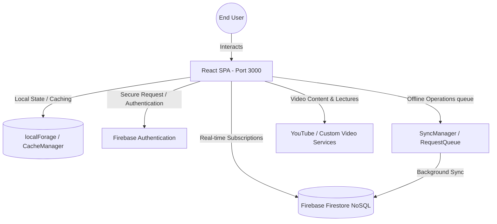

# 📚 MathLiteracy Pro: Platform Documentation

Welcome to the official developer and architecture documentation repository for the **MathLiteracy Pro** platform. This hub serves as the definitive reference for engineering, deploying, and contributing to the application.

MathLiteracy Pro is an advanced, curriculum-aligned, interactive learning management system (LMS) designed to deliver high-quality South African **CAPS (Curriculum Assessment Policy Statements)** Mathematical Literacy education for Grades 10–12.

---

## 🔗 Quick Navigation

| Documentation Section | File Path | Focus Area |
| :--- | :--- | :--- |
| **🚀 Main Overview** | [README.md](./README.md) | Project summary, tech stack, and landing hub |
| **🎨 Page Guides** | `/pages/` | Modular analysis of all 8 core application screens |
| ├── Dashboard | [dashboard.md](./pages/dashboard.md) | Dynamic study statistics, widgets, and user hubs |
| ├── Courses Catalog | [courses.md](./pages/courses.md) | Topic structures, lessons, and search parameters |
| ├── Interactive Study | [study.md](./pages/study.md) | Video player, playlist controls, and session states |
| ├── Daily Tasks | [tasks.md](./pages/tasks.md) | Practice templates, countdowns, and submissions |
| ├── Profile & Settings | [profile.md](./pages/profile.md) | User progress tracking, achievement badges, and security |
| ├── Editorial Blog | [blog.md](./pages/blog.md) | Educational articles, user comments, and reading progress |
| ├── Instructors Hub | [instructors.md](./pages/instructors.md) | Instructor profiles, stats sheets, and educator onboarding |
| └── Authentication | [auth.md](./pages/auth.md) | Custom security, multi-provider credentials, and verification |
| **🧱 Technical Architecture** | `/architecture/` | Low-level design, database schemas, and networking |
| ├── High-Level Overview | [overview.md](./architecture/overview.md) | Component trees, lifecycle hooks, and structural design |
| ├── Firestore Schema | [database-schema.md](./architecture/database-schema.md) | Detailed documentation of collections, fields, and relations |
| ├── Security Rules | [security-rules.md](./architecture/security-rules.md) | Multi-layered Firestore security protocols and permissions |
| └── Offline Network | [network-handler.md](./architecture/network-handler.md) | Synchronizer state queues, local storage caching, and health |
| **🔌 API Reference** | [endpoints.md](./api/endpoints.md) | Core serverless and third-party endpoints, payloads, and queries |
| **🛠️ Setup & Operations** | `/guides/` | Practical onboarding and operational guidelines |
| ├── Developer Setup | [setup.md](./guides/setup.md) | Installation steps, script configs, and environment setup |
| ├── Deployment | [deployment.md](./guides/deployment.md) | Continuous builds, CI pipelines, and live scaling steps |
| └── Contributing | [contributing.md](./guides/contributing.md) | Coding style, commit standards, and PR workflows |

---

## 🛠️ System Architecture & Technology Stack

The platform is engineered using modern, modular web technologies for optimal performance, offline capabilities, and high reliability:

### Frontend Layer
- **Framework**: React 18+ (TypeScript)
- **Bundler**: Vite (fully optimized tree-shaking, fast module bundling)
- **Styling**: Tailwind CSS (dynamic utility class architecture)
- **Animations**: `motion` (by `motion/react` for elegant, hardware-accelerated transitions)
- **Routing**: React Router DOM (fully declared client-side router with state syncing)
- **Visualization**: Recharts & D3 (for dynamic analytics, study trends, and badge progress charts)

### Backend & Database Layer
- **Core Engine**: Firebase Firestore (NoSQL Document Store)
- **User Authentication**: Firebase Auth (email verification, secure session tokens, role management)
- **File & Media Storage**: Firebase Cloud Storage (task documents, profile pictures, course content)
- **Server Environment**: Express (deployed via lightweight containers)

### Infrastructure & Operations
- **Containerization**: Docker (Vite + Express in multi-stage builds)
- **Ingress Gateway**: NGINX Reverse Proxy (SSL termination, rate-limiting)
- **Local Sandbox Environment**: Port `3000` (strictly hardcoded container routing)

---

## 🌐 Live Platform Details

- **Official Live Demo Domain**: `https://mathlit.free.nf`
- **Development Ingress Endpoint**: `https://ais-dev-bdzycqzz3iml2b4gaqwb65-977883421679.europe-west2.run.app`
- **Shared Production Preview**: `https://ais-pre-bdzycqzz3iml2b4gaqwb65-977883421679.europe-west2.run.app`

### Current Deployment Status
```text
[✔] Continuous Deployment: ACTIVE
[✔] Cloud Container Registry: SUCCESS (GCR/Cloud Run)
[✔] Database Rule Enforcement: STRICT DEPLOYED
[✔] Linter & Typechecks: 100% GREEN (tsc --noEmit)
```

---

## 📐 Conceptual Application Flow



---

*This documentation is created and managed by the MathLiteracy Pro Core Development Team. For support inquiries, reach out to the platform's security officer or open a issue following the guidelines in the [Contributing Guide](./guides/contributing.md).*
